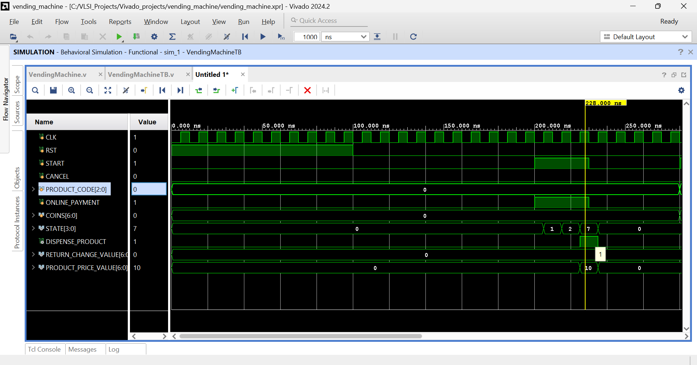
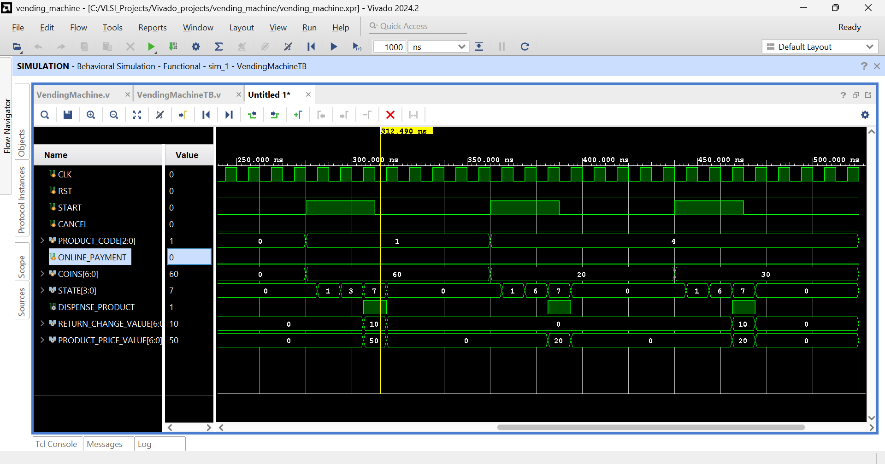
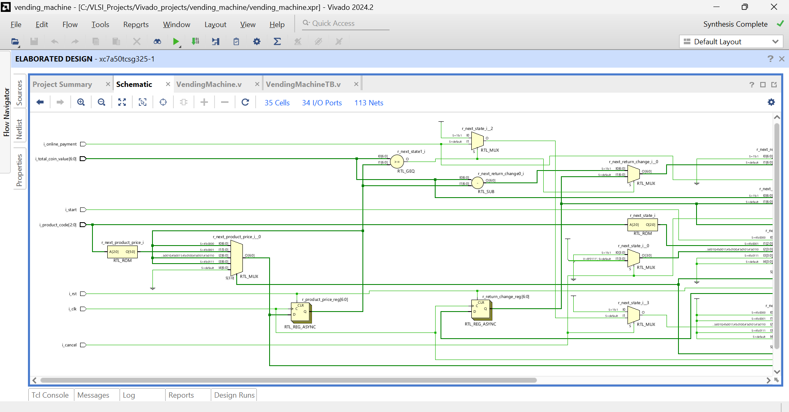
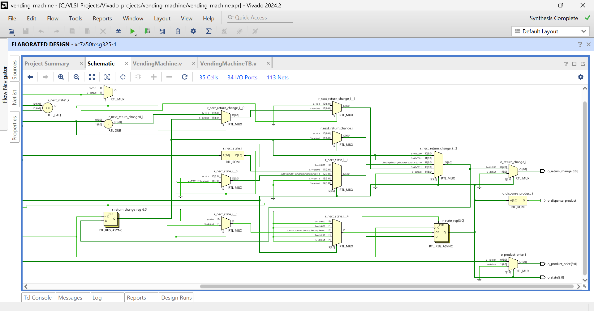

# FSM-Based Vending Machine Controller
**RTL Design | Verilog HDL | Synthesized on Artix-7 FPGA**

Implements a Vending Machine Controller in Verilog HDL using a Mealy/Moore
hybrid FSM. Supports 5 products, dual payment modes (coin + online), 
automatic change calculation, and transaction cancellation.
Synthesized and simulated on **Xilinx Vivado 2024.2** targeting the
**Artix-7 (xc7a50tcsg325-1)** FPGA.

---

## Features
- 8-state FSM with parameterized product prices
- 5 products: Pen (₹10), Water Bottle (₹20), Lays (₹20), Coke (₹35), Notebook (₹50)
- Dual payment: coin insertion OR online payment bypass
- Automatic change calculation and return
- Cancel transaction at any state — returns inserted coins
- Fully synthesizable RTL with asynchronous reset

---

## FSM State Table

| State | Encoding | Description |
|-------|----------|-------------|
| IDLE | 4'b0000 | Waiting for START signal |
| SELECT_PRODUCT | 4'b0001 | Decodes product code, loads price |
| PEN_SELECTION | 4'b0010 | Waiting for payment — Pen (₹10) |
| NOTEBOOK_SELECTION | 4'b0011 | Waiting for payment — Notebook (₹50) |
| COKE_SELECTION | 4'b0100 | Waiting for payment — Coke (₹35) |
| LAYS_SELECTION | 4'b0101 | Waiting for payment — Lays (₹20) |
| WATER_BOTTLE_SELECTION | 4'b0110 | Waiting for payment — Water Bottle (₹20) |
| DISPENSE_AND_RETURN | 4'b0111 | Dispenses product, calculates and returns change |

---

## Simulation Results

### Test Case 1 — Online Payment Flow

- START asserted → SELECT_PRODUCT → PEN_SELECTION_STATE (state 2)
- ONLINE_PAYMENT=1 → jumps directly to DISPENSE_AND_RETURN (state 7)
- PRODUCT_PRICE=10, RETURN_CHANGE=0, DISPENSE_PRODUCT=HIGH ✅

### Test Case 2 — Coin Payment, Multiple Products

- Product Code 1 (Notebook, ₹50): COINS=60 → DISPENSE ✅, CHANGE=10
- Product Code 4 (Water Bottle, ₹20): COINS=20 → DISPENSE ✅, CHANGE=0
- Product Code 4 (Water Bottle, ₹20): COINS=30 → DISPENSE ✅, CHANGE=10
- State transitions 0→1→6→7→0 verified ✅

---

## Synthesis Results — Xilinx Artix-7 (xc7a50tcsg325-1)

| Resource | Used | Available | Utilization |
|----------|------|-----------|-------------|
| Slice LUTs | 45 | 32,600 | 0.14% |
| Flip-Flops | 16 | 65,200 | 0.02% |
| I/O Ports | 34 | 150 | 22.67% |
| BUFGCTRL | 1 | 32 | 3.13% |
| Block RAM | 0 | 75 | 0.00% |
| DSPs | 0 | 120 | 0.00% |

### RTL Schematic

**Top-level view:**

**Datapath detail:**

Key inferred primitives:
- `RTL_ROM` — product price lookup from case statement
- `RTL_REG_ASYNC` — state, price, change registers with async reset (16 FDCEs)
- `RTL_GEQ / RTL_SUB` — coin vs price comparison and change calculation
- `RTL_MUX` trees — next-state and output selection logic

Full utilization report: [synth/utilization_report2.txt](synth/utilization_report2.txt)

---

## Project Structure
- src/

  VendingMachine.v         # RTL design source
  VendingMachineTB.v       # Testbench

- simulation/                  # Waveform screenshots

- synth/                       # Schematic screenshots + utilization report
  
---

## Tools
- Xilinx Vivado 2024.2
- Target: xc7a50tcsg325-1 (Artix-7, Speed Grade -1)
- HDL: Verilog (IEEE 1364-2001)
- 
